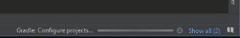
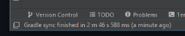
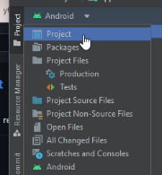
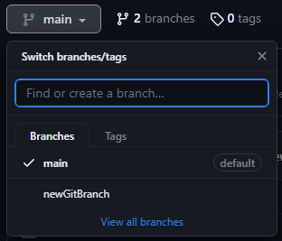
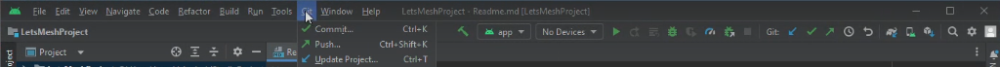

## Let's Mesh

Let's Mesh professional match-making site for Mentors & Educators within various career disciplines to be matched with mentees in search of mentorship.

## Installation

Use the link [Android Studio](https://developer.android.com/studio) to install Android Studio.
Click on the green button that says "Download Android Studio Electric Eel"

Navigate to the Android Studio download page and follow the instructions to download and install 
Android Studio. Accept the default configurations for all steps, and ensure that all components are 
selected for installation. After the install is complete, the setup wizard downloads and installs 
additional components, including the Android SDK. Be patient, because this process might take some 
time, depending on your internet speed. When the installation completes, Android Studio starts, and 
you are ready to create your first project.

Once installed
1. Click on "New Project."
2. Click on "No Activity." 
3. Rename your application to your preference, preferably something related to the project. 
4. Change the language to "Java." Click "Finish."
Wait for your android studio to load. Look at the bottom right corner (image) and wait for it to finish loading. 
 
The bottom left side should display "Gradle Sync Finished" 
Then move onto the next step. 

## Cloning From Github
Follow the instructions on this link [How to Clone Android Project from GitHub in Android Studio?](https://www.geeksforgeeks.org/how-to-clone-android-project-from-github-in-android-studio/)
but for the project, follow steps below.
1. Click on this [Project Link](https://github.com/rllov/LetsMeshProject.git).
2. Click on the green <>Code button.
3. Copy the Link.
4. Go back to Android Studio and paste the link as the URL.
5. Click "Clone"
6. Click on "Trust Project"
7. Once you have finished the steps, you may begin coding/designing.

You could also change this to view your files easier. 
Note: You can download github through Android Studio

## Create a Branch for yourself to Push and pull.
You can add a branch through the github website or through Android Studio. 
1. Github Website
   1. Make sure you are on the project
   2. Click on image to display, find, or create branches. 
   3. You may begin pulling/pushing your repositories
2. Android Studio
   1. Click on Git at the top tool bar 
   2. Click on "New Branch..."
   3. Enter a Branch name, preferably your name.
  
## Pulling from Github
Once you have cloned your repository, you are able to now pull from the main branch to your device. 
In order to that,
1. Click on Git at the top tool bar .
2. Click on "Pull..." to pull it from the main branch.

## Pushing to github
To push to github
1. Make sure all files are saved (ctrl + s)
2. Click on Git at the top tool bar 
3. Click on "Commit"
4. Add a comment of what you changed/ added.
5. Click on "Commit"
6. Select your branch
 

## Contributing

Pull and Cloning requests are welcome. For major changes, please open an issue first
to discuss what you would like to change. When pushing back to 

