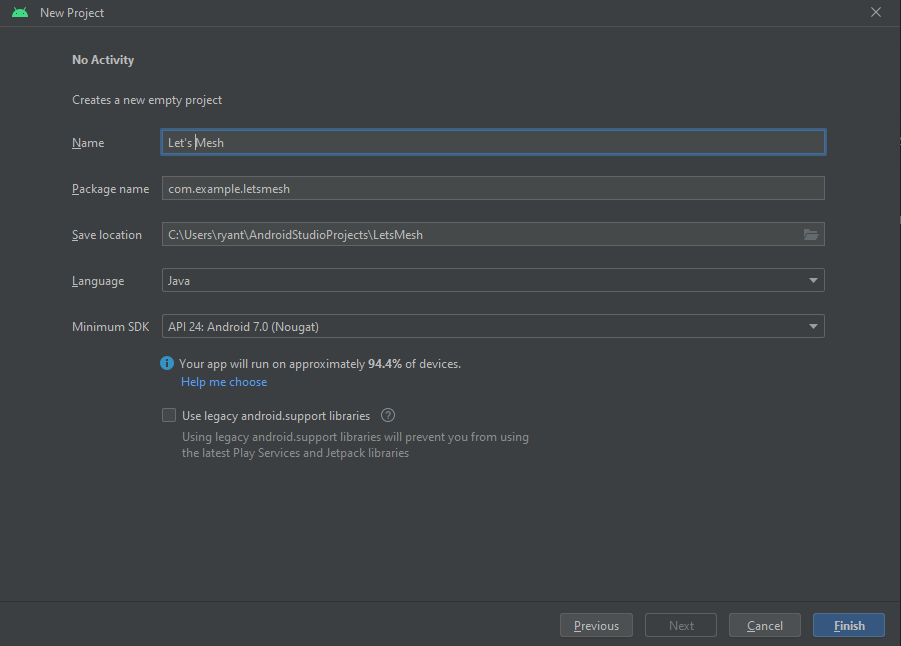

## Let's Mesh

Let's Mesh professional match-making site for Mentors & Educators within various career disciplines to be matched with mentees in search of mentorship.

## Installation

Use the link [Android Studio](https://developer.android.com/studio) to install Android Studio.
Click on the green button that says "Download Android Studio Electric Eel"

Navigate to the Android Studio download page and follow the instructions to download and install 
Android Studio. Accept the default configurations for all steps, and ensure that all components are 
selected for installation. After the install is complete, the setup wizard downloads and installs 
additional components, including the Android SDK. Be patient, because this process might take some 
time, depending on your internet speed. When the installation completes, Android Studio starts, and 
you are ready to create your first project.

## Pulling From Github
If this is your first time pulling from Github, select "No Activity" as a new project. Enter a name 
for the file, preferably something that is notable to this project. Change the Language to "Java."
!</img>

## Contributing

Pull requests are welcome. For major changes, please open an issue first
to discuss what you would like to change.

Please make sure to update tests as appropriate.
